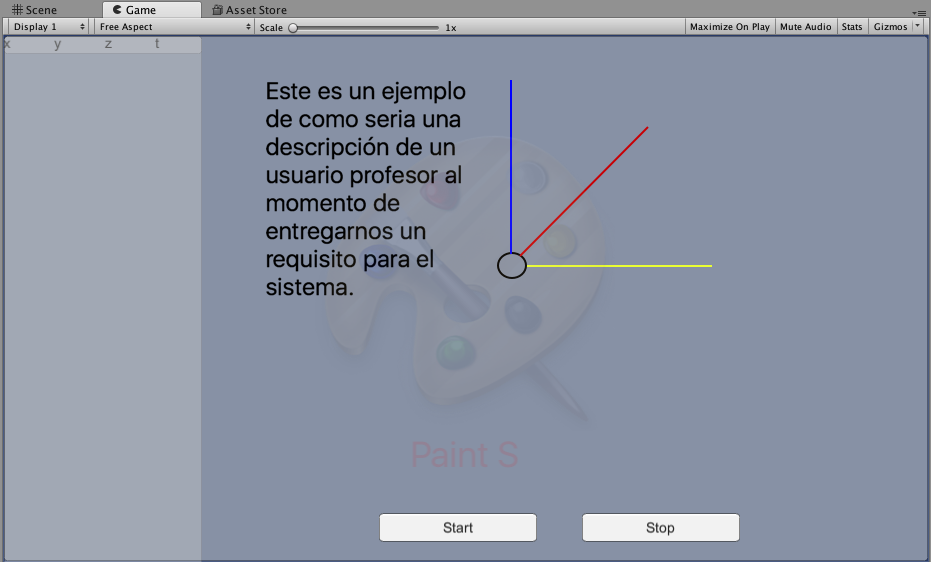
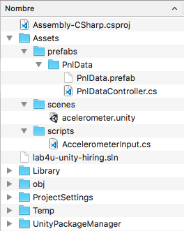

# lab4u-unity-hiring
El objetivo de este repositorio es una base de codigo con ciertas preguntas que los candidatos deben realizar para mostrar sus habilidades

## Descripción del ejercicio 

El ejercicio consta de una unica escena que contiene una aplicación con ciertos errores y TODOs: "temas por hacer" que el candidato debe intentar resolver.

Mas que terminar de realizar el ejercicio se trata de comentar todo lo que el 
canditado considere que se puede mejorar.
Cada Historia de Usuario(US) esta implementada o no en el ejemplo 

## Funcionalidades del ejercicio.

#### US_001: Como usuario debo poder iniciar la lectura del acelerometro para poder ver sus datos.
**Criterio de aceptación**
1. Al momento de iniciar el sistema debe empezar a mostar todos los datos a la izquierda de la pantalla.
2. Al momento de ver los datos el sistema debe seguir el ultimo dato ingresado, de ser necesario tener un scroll para ir siguiente el dato.
3. Debe poder ir siguiente el movimiento del acelerometro de un android.
2. Una vez iniciado el sistema se debe deshabilitar el boton de inicio hasta que el boton de detención vuelva a ser presionado.
#### US_002: Como usuario debo poder revisar todos los datos recolectados por el acelerometro.
**Criterio de aceptación**
1. Debo poder desplazarme por todos los datos recolectados.
#### US_003: Como usuario debo poder detener la lectura del acelerometro.
**Criterio de aceptación**
1. Al momento de detener el sistema muestra el ultimo dato ingresado.
2. Una vez detenido el sistema debe deshabilitar el boton de detención hasta que el boton de inicio vuelva a ser presionado.
#### US_004: Como usuario debo poder limpiar todos los datos que ha recolectado el sistema para volver a empezar.
**Criterio de aceptación**
1. La pantalla debe volver a su estado inicial como si nada hubiera pasado.
#### US_005: (DESEABLE) Como usuario al momento de iniciar la lectura debo ver el movimiento de 2 o 3 ejes utilizando un modelo de vectores.
**Criterio de aceptación**
1. El sistema debe mostrar la acelaración en forma de un vector.

## Estructura del directorio 
El siguiente diagrama es la estructura desde la carpeta lab4u-unity-hiring,
todo el contenido adicional solo es parte de la explicación del ejercicio.

Los componentes mas importantes son:

1. AccelerometerInput.cs, script que controla la recepción de datos del acelerometro.
2. PnlDataController.cs, script  que controla la funcionalidad del prefap que contiene a cada dato.

El candidato puede iniciar su trabajo abriendo la escena: acelerometer 
y revisar como esta construida y hacerle las mejoras que crea convenientes, no hay ninguna restricción respecto a las mejoras.

## Como presentar el ejercicio
Para presentar el ejercicio es necesario que el candidato realice un fork de 
este proyecto para que el pueda realizar sus propios commits.

La notificación de finalización del ejercicio debe ser enviada a:
#### alvaro@lab4u.co

Una vez enviado, el equipo de lab4u le notificara que ya se ha descargado el 
proyecto de github y el candidato puede optar por borrar el proyecto o tenerlo como parte de su listado de proyectos de github.

